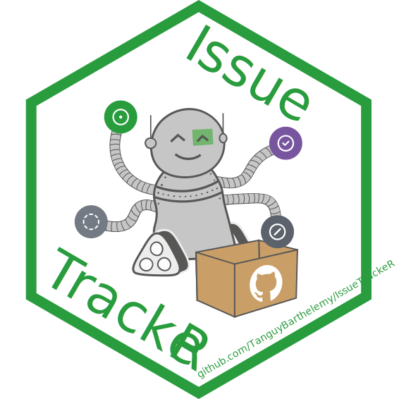

<!-- README.md is generated from README.Rmd. Please edit that file -->

# {IssueTrackeR} <a href="https://tanguybarthelemy.github.io/IssueTrackeR/"></a>

<!-- badges: start -->

[](https://CRAN.R-project.org/package=IssueTrackeR)
[](https://github.com/TanguyBarthelemy/IssueTrackeR/actions/workflows/R-CMD-check.yaml)
[](https://github.com/TanguyBarthelemy/IssueTrackeR/actions/workflows/pkgdown.yaml)

[](https://github.com/TanguyBarthelemy/IssueTrackeR/actions/workflows/lint.yaml)
[](https://app.codecov.io/gh/TanguyBarthelemy/IssueTrackeR)
[](https://www.codefactor.io/repository/github/tanguybarthelemy/issuetracker)
<!-- badges: end -->

**{IssueTrackeR}** is an R package designed to retrieve and manage
GitHub issues directly within R. This package allows users to
efficiently track and handle issues from their GitHub repositories.

This package relies a lot on the package
[{gh}](https://github.com/r-lib/gh) to use the GitHub API and retrieve
data from GitHub.

## Installation

You can install the development version of {IssueTrackeR} from
[GitHub](https://github.com/) with:

``` r
# install.packages("remotes")
remotes::install_github("TanguyBarthelemy/IssueTrackeR")
```

## Features

- **Retrieve Issues**: Fetch issues from any (with sufficient rights)
  GitHub repository.
- **Issue Management**: Class S3 to manage the issues as a datasets
  within R.
- **Filtering**: Filter issues by labels, content and milestones.

## Usage

``` r
library("IssueTrackeR")
#> 
#> Attaching package: 'IssueTrackeR'
#> The following objects are masked from 'package:base':
#> 
#>     append, sample
```

### Retrieve information from GitHub

To get information from a repository, you can call the functions
`get_issues`, `get_labels` and `get_milestones`

``` r
# From online
my_issues <- get_issues(source = "online", owner = "jdemetra", repo = "jdplus-main", verbose = FALSE)
my_labels <- get_labels(source = "online", owner = "jdemetra", repo = "jdplus-main")
#> Reading labels... Done!
#> 12 labels found.
my_milestones <- get_milestones(source = "online", owner = "jdemetra", repo = "jdplus-main")
#> Reading milestones... 
#>  -  backlog ... Done!
#>  -  3.2.2 ... Done!
#>  -  3.2.3 ... Done!
#>  -  3.4.0 ... Done!
#>  -  3.5.0 ... Done!
#>  -  3.5.1 ... Done!
#>  -  3.6.0 ... Done!
#> Done! 7 milestones found.
```

### Save issues in local

You can also write the datasets in local with
`write_issues_to_dataset()`, `write_labels_to_dataset()` and
`write_milestones_to_dataset()`:

``` r
write_issues_to_dataset(
    issues = my_issues, 
    dataset_dir = tempdir()
)
#> The datasets will be exported to /tmp/Rtmpyc9CiM/list_issues.yaml.

write_labels_to_dataset(
    labels = my_labels, 
    dataset_dir = tempdir()
)
#> The datasets will be exported to /tmp/Rtmpyc9CiM/list_labels.yaml.

write_milestones_to_dataset(
    milestones = my_milestones, 
    dataset_dir = tempdir()
)
#> The datasets will be exported to /tmp/Rtmpyc9CiM/list_milestones.yaml.
```

### Options

It is also possible to set option for a R session:

``` r
# The directory containing the yaml files in local
options(IssueTrackeR.dataset.dir = tempdir())
# The default GitHub owner
options(IssueTrackeR.owner = "jdemetra")
# the default GitHub repository
options(IssueTrackeR.repo = "jdplus-main")
```

### Retrieve issues from local

Then it’s possible to read Issues from local yaml files:

``` r
# From local
my_issues <- get_issues(source = "local")
my_labels <- get_labels(source = "local")
my_milestones <- get_milestones(source = "local")
```

### Update full database

You can update your full database of issues, labels and milestones with
`update_database()`:

``` r
# From online
update_database(verbose = FALSE)
```

## Contributing

Contributions are welcome! Please feel free to submit a pull request or
report any issues.

## License

This project is licensed under the MIT License. See the
[LICENSE](LICENSE) file for details.
